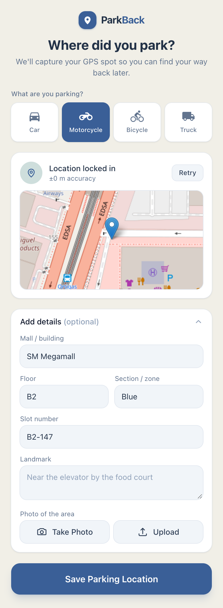
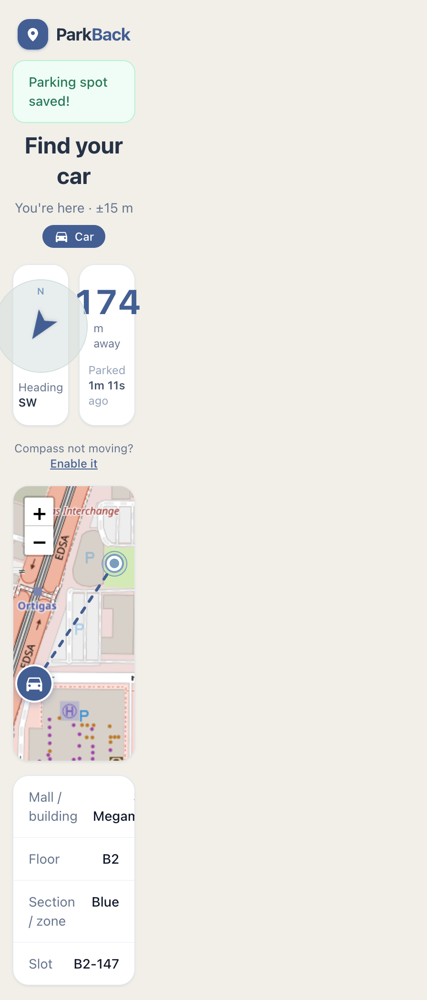

# ParkBack

**Never lose your car (or motorcycle, bike, or truck) in a parking lot again.**

ParkBack is a mobile‑first web app that remembers where you parked and guides
you back. Save your GPS spot with a tap, add a few details and a photo, then let
ParkBack show you the distance, direction, and a map back to your vehicle.

<p align="center">
  
  &nbsp;&nbsp;
  
</p>

## Features

- **One‑tap save** – records your current GPS location.
- **Vehicle types** – car, motorcycle, bicycle, or truck (the map marker adapts).
- **Helpful details** – mall/building, floor, section/zone, slot number, landmark.
- **Photo of the spot** – take a new photo with the camera or upload one from your gallery, with a live preview.
- **Find My Car** – live walking distance, compass heading, an interactive map
  (Leaflet + OpenStreetMap) with a route line, and the time elapsed since you parked.
- **No sign‑up** – each browser owns its parking spot via a signed cookie.

## Tech stack

- **Ruby on Rails 8** (Ruby 3.3)
- **PostgreSQL** + **Active Storage** (photo uploads)
- **Hotwire** (Turbo + Stimulus) via import maps
- **Tailwind CSS v4**
- **Leaflet** / **OpenStreetMap** for mapping (no API key required)

## Getting started

### Prerequisites

- Ruby 3.3.x
- PostgreSQL running locally
- Node is **not** required (import maps + Tailwind are handled by Rails)

### Setup

```bash
git clone https://github.com/lfigueras/Park-Back.git
cd Park-Back
bin/setup            # installs gems, prepares the database
```

### Run

```bash
bin/dev              # starts Rails + Tailwind watcher
```

Then open http://localhost:3000.

> **Note:** browser geolocation requires `localhost` or HTTPS. The compass
> heading uses device orientation and only moves on a real phone (iOS asks for
> permission via the "Enable it" button).

## Production deployment

The production app is hosted on Render and uses Neon Postgres. Set
`RAILS_MASTER_KEY` from `config/master.key` and `DATABASE_URL` to the pooled
connection string for Neon’s `production` branch in the Render environment.
Keep the database URL secret. The pooled endpoint requires prepared statements
to be disabled, as configured in `config/database.yml`.

## Running tests

```bash
bin/rails test
```

## How it works

1. Open ParkBack and pick your vehicle type.
2. Tap **Save Parking Location** – your GPS spot is captured (add details/photo as needed).
3. When you're ready to leave, open the app and it jumps to **Find My Car**.
4. Follow the distance, compass arrow, and map back to your vehicle.
5. Tap **I found my …** to clear the spot.
